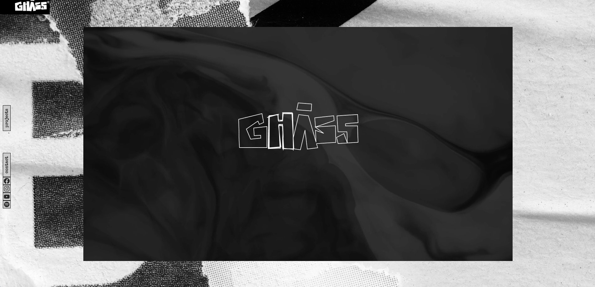

# GHASS | Music Production & Composition Portfolio

[🌐 View the live website](https://www.ghass.es)

Welcome to the official portfolio website for **GHASS**, a music production and composition project based in Spain, co-created by **Fernan Mejuto** and **Miguel Gonzalez**.

## Portfolio Showcase

This website serves as a **showcase of my personal portfolio**. It was fully designed and developed by me, **Fernan Mejuto**, as part of my professional portfolio to demonstrate my skills in web development, design, and music production.

## Preview

## About

GHASS specializes in creating custom music for a wide range of projects, from audiovisual productions to live music performances. With a focus on originality and artistic direction, GHASS offers services including:

- Music Composition & Sync
- Music Editing
- Music Production
- Artistic and Musical Direction
- Arrangements

## Website Features

- **Portfolio Gallery:** Showcases selected works with embedded audio (SoundCloud) and video (YouTube) players.
- **Contact Section:** Allows visitors to get in touch directly via a contact form.
- **Responsive Design:** Built with HTML, CSS, and Bootstrap for compatibility across devices.
- **Social Media Integration:** Links to SoundCloud, GitHub, Twitter, Instagram, and CodePen.
- **Custom Visuals:** Includes unique artwork and branding assets.

## Getting Started

To view the website locally:

1. Clone or download this repository.
2. Open `portfolio-scroll.html` in your web browser.

No build steps are required; all dependencies are loaded via CDN.

## Credits

- **Site designed, developed, and programmed by:** Fernan Mejuto
- **Co-designed with:** Javier Querentes
- **Co-created with:** Miguel Gonzalez

## License

All rights reserved © GHASS

---

For more information, visit [www.ghass.es](http://www.ghass.es) or contact us at info@ghass.es.
